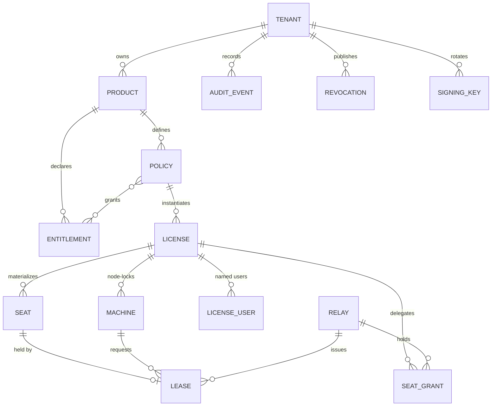

# 4. Doménový model a licenčné modely

> Časť zadania **Symbolon — licenčný server na .NET 10**. Späť na [obsah](README.md) · [prehľad projektu](../README.md).

## 4.1 Entity



| Entita | Zmysel | Kľúčové polia |
|---|---|---|
| `Tenant` | Vydavateľ licencií (ISV). V self-hosted režime typicky jeden. | `id`, `slug`, `signing_key_set_id` |
| `Product` | Softvérový produkt. | `id`, `code`, `name`, `platforms[]` |
| `Entitlement` | Pomenované oprávnenie (feature flag / kvóta). | `code` (napr. `module.cad-export`), `type` (`boolean`\|`quota`\|`scalar`) |
| `Policy` | Šablóna licencie — všetko, čo definuje správanie. | viď 4.2 |
| `License` | Konkrétna licencia zákazníka. | `id`, `key_hash`, `key_lookup`, `policy_id`, `customer_ref`, `state`, `issued_at`, `expires_at`, `max_seats`, `overage_strategy` |
| `Seat` | **Materializované sedadlo.** Pre licenciu s `max_seats = N` existuje N riadkov (+ overage riadky). | `license_id`, `seat_no`, `lease_id?`, `expires_at?`, `holder_fp?` |
| `Lease` | Aktívne držanie sedadla. | `id`, `seat_id`, `machine_id`, `process_id?`, `issued_at`, `expires_at`, `state`, `relay_id?`, `borrowed_until?` |
| `Machine` | Node-locked stroj / fingerprint. | `id`, `license_id`, `fingerprint`, `components{}`, `first_seen`, `last_heartbeat`, `state` |
| `Relay` | Registrovaný on-prem relay. | `id`, `name`, `mtls_thumbprint`, `last_sync`, `version` |
| `SeatGrant` | **Delegovaná kapacita** pre relay. | `id`, `license_id`, `relay_id`, `seats`, `not_before`, `not_after`, `seq`, `signature` |
| `AuditEvent` | Append-only ledger. | `id` (ULID), `ts_server`, `type`, `license_id`, `subject`, `payload` (jsonb), `prev_hash`, `hash` |
| `Revocation` | Položka revokačného zoznamu. | `subject_type`, `subject_id`, `reason`, `revoked_at` |
| `SigningKey` | Kľúč v kľúčovom kruhu. | `kid`, `alg`, `role` (`root`\|`product`\|`lease`), `public_jwk`, `not_before`, `not_after`, `state` |

## 4.2 Politika (Policy) — konfiguračný povrch

Vedomé prevzatie modelu, ktorý Keygen odladil na produkčnej prevádzke. Nevymýšľame nové názvoslovie tam, kde existujúce funguje.

```jsonc
{
  "code": "pro-floating-annual",
  "productCode": "acme-cad",
  "licenseModel": "floating",          // perpetual | subscription | trial | floating | named-user | metered
  "duration": "P1Y",                   // ISO-8601, null = perpetual
  "maxSeats": 25,
  "seatUnit": "machine",               // machine | process | user | core
  "overageStrategy": "no-overage",     // no-overage | allow-1.25x | allow-1.5x | allow-2x | always-allow
  "expirationStrategy": "restrict",    // restrict | revoke | maintain | allow
  "lease": {
    "ttl": "PT10M",                    // platnosť lease tokenu
    "heartbeatInterval": "PT2M",       // ako často má klient obnoviť
    "graceTtl": "PT4H",                // offline grace u klienta pri výpadku servera
    "resurrectionWindow": "PT5M",      // klient smie získať späť VLASTNÉ sedadlo po zmeškanom heartbeate
    "cullStrategy": "release",         // release | keep
    "queue": { "enabled": true, "maxWait": "PT2M", "policy": "fifo" }
  },
  "borrow": { "enabled": true, "maxDuration": "P7D", "maxConcurrent": 5, "earlyReturn": true },
  "machineMatching": "match-most",     // match-any | match-two | match-most | match-all
  "machineUniqueness": "per-license",
  "requireHeartbeat": true,
  "offline": { "allowed": true, "fileTtl": "P30D", "maxFileTtl": "P90D" },
  "entitlements": ["core", "module.cad-export", { "code": "quota.render-minutes", "value": 5000 }],
  "crypto": { "profile": "hybrid-v1" } // hybrid-v1 | classical-v1 | pq-only-v1
}
```

**Rozhodnutie o `seatUnit`:** granularitu sedadla je nutné vybrať *pred* prvým predajom — je to cenový model, nie implementačný detail. Retrofit znamená prerobiť zmluvy. Preto je to povinné pole bez defaultu.

## 4.3 Podporované licenčné modely

| Model | Ako sa implementuje | Poznámka |
|---|---|---|
| **Perpetual** | `duration = null`, licenčný súbor bez `exp`, `maintenance_until` claim | Najdlhšie žijúci artefakt → **najsilnejší dôvod pre PQC** |
| **Subscription** | `duration` + obnova licenčného súboru cez API | Krátke TTL súboru (30 d) = de facto revokácia |
| **Trial** | `licenseModel: trial` + `maxActivations = 1` + serverom vydaný `trial_id` viazaný na fingerprint | Ochrana proti reset-abuse na strane servera, nie klienta |
| **Node-locked** | `Machine` + fingerprint matching, bez leases | Fuzzy matching (kap. 7.6) |
| **Floating / concurrent** | `Seat` + `Lease` + heartbeat | Jadro projektu |
| **Named user** | `LicenseUser` + `seatUnit: user`; sedadlo viazané na identitu, nie na stroj | Vyžaduje identitu z klienta (OIDC alebo OS user hash) |
| **Borrow / roaming** | Lease s `borrowed_until` a offline `.symlease` súborom | Sedadlo je mŕtva kapacita po celý čas — agresívny cap |
| **Token / credit** | Entitlement typu `quota` + atomické dekrementovanie | V1 „could" |
| **Metered** | Append-only usage events, agregácia dávkovo | V1 „could" |

---

[← 3. Rozsah projektu](03-rozsah.md) · [Obsah](README.md) · [5. Formát licencie — návrh variantov a rozhodnutie →](05-format-licencie.md)
