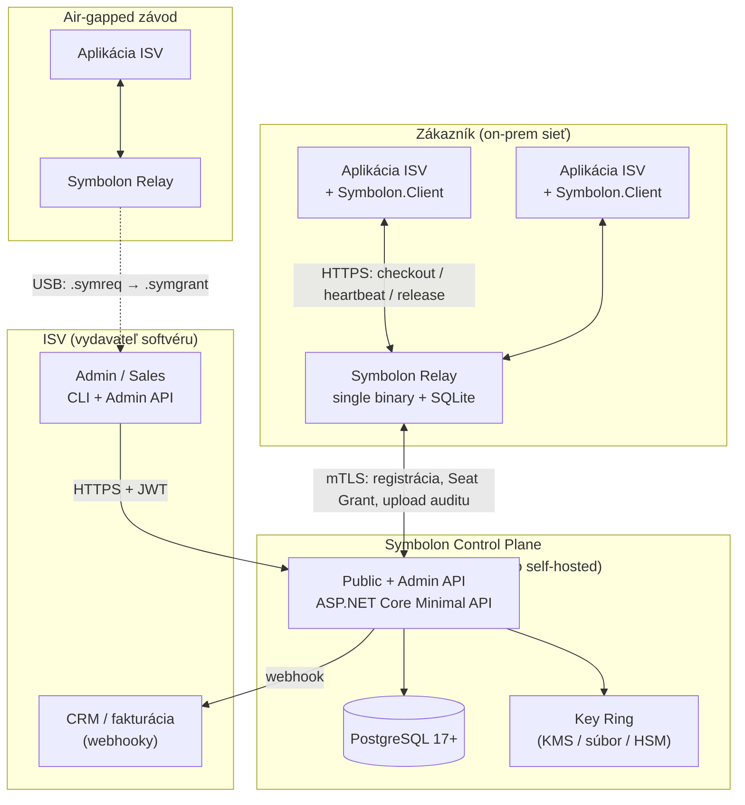
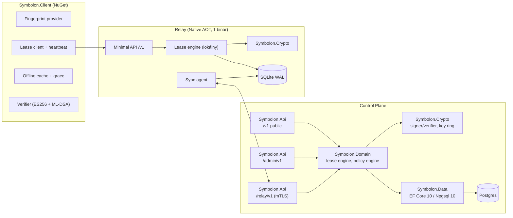

# 6. Architektúra

> Časť zadania **Symbolon — licenčný server na .NET 10**. Späť na [obsah](README.md) · [prehľad projektu](../README.md).

## 6.1 Kontext (C4 — úroveň 1)



## 6.2 Kontajnery (C4 — úroveň 2)



## 6.3 Architektonické rozhodnutia (ADR)

### ADR-001 — .NET 10 LTS + ASP.NET Core Minimal API

**Rozhodnutie.** Celý systém na .NET 10 (GA 11. 11. 2025, LTS do 14. 11. 2028), C# 14, Minimal API.

**Argumenty.**
- Jediný mainstream runtime s **natívnym PQC API v BCL** (`System.Security.Cryptography.MLDsa`, `MLKem`, `SlhDsa`). V Jave/Node/Go potrebuješ tretiu stranu (BouncyCastle, liboqs) — pri kryptografickom produkte je „krypto od dodávateľa platformy" reálny argument v bezpečnostnom audite.
- Zdrojovo generovaná validácia (`Microsoft.Extensions.Validation`, `AddValidation()`, `[ValidatableType]`) — bez reflexie, AOT-friendly. *(Pozor: `AddValidation()` musí byť volané zo zostavy, v ktorej sú endpointy, inak sa zdrojový generátor nespustí. Platí pre Minimal API a Blazor, nie pre MVC.)*
- OpenAPI **3.1** (`Microsoft.AspNetCore.OpenApi` 2.0.0) vrátane **generovania dokumentu pri builde** (`OpenApiGenerateDocumentsOnBuild`) → kontraktný diff v CI.
- `IApiEndpointMetadata` v .NET 10 opravuje klasický bug „302 namiesto 401" pre API endpointy.
- Cieľová skupina (ISV s on-prem .NET produktmi) beží .NET — jeden runtime pre server aj SDK znižuje bariéru prijatia.

**Riziká.** macOS nemá v .NET 10 PQC podporu vôbec → viď ADR-003.

### ADR-002 — Postgres pre control plane, SQLite pre relay

**Rozhodnutie.** Control plane: PostgreSQL 17+, EF Core 10, Npgsql 10.0.3. Relay: SQLite (WAL), prístup cez `Microsoft.Data.Sqlite` + Dapper, **bez EF Core**.

**Argumenty.**
- Relay musí byť **jeden binár bez závislostí**, ktorý admin zákazníka rozbalí a spustí. To je jediný spôsob, ako poraziť `lmgrd` na deployment UX. SQLite + Native AOT to dáva; EF Core to znemožňuje (viď ADR-007).
- Postgres dáva pre control plane presne to, čo potrebujeme pre účtovanie sedadiel: `SELECT … FOR UPDATE SKIP LOCKED`, `pg_advisory_xact_lock`, `xmin` ako optimistický concurrency token bez schémovej réžie (`UseXminAsConcurrencyToken()`), `jsonb` pre audit payload, a HA cez streaming replikáciu / Patroni / RDS Multi-AZ.
- EF Core 10 prináša **complex types** (`ComplexProperty(…, c => c.ToJson())`) — správny nástroj pre value objekty (`Fingerprint`, `EntitlementSet`) a **pomenované query filtre** pre kombináciu soft-delete + tenant izolácia bez ručného skladania.

**Zamietnuté alternatívy.** Redis ako zdroj pravdy o sedadlách (nie je bezpečné pre tvrdý limit počtu — pri failoveri sa dá stratiť zápis; použijeme ho maximálne ako voliteľnú cache/rate-limiter). MongoDB (chýba transakčná ergonómia pre počítanie sedadiel). Marten/event sourcing (zbytočná zložitosť pre V1; audit ledger rieši potrebu histórie).

### ADR-003 — Hybridný podpis dvomi nezávislými podpismi, nie `CompositeMLDsa`

**Rozhodnutie.** Dlhoveké artefakty podpisujeme **dvakrát**: `ES256` (ECDSA P-256, natívne, všade) a `ML-DSA-65` (FIPS 204, `MLDsa` API). Podpisy sú samostatné položky v poli `signatures` JWS General JSON. Politika požadovaných algoritmov je vnútri podpísaného payloadu (`requiredAlgs`).

**Argumenty.**
- `CompositeMLDsa` je `[Experimental]` (SYSLIB5006 — rovnako ako `MLDsa` a `SlhDsa`; z PQC rodiny je stabilný len typ `MLKem`, a aj tam sú niektoré metódy experimentálne) a **atomický** — verifikátor bez PQC podpory neoverí ani klasickú polovicu. Pri klientskom SDK, ktoré beží na macOS (žiadne PQC v .NET 10) a na starších runtime, je to blokujúce.
- Dva podpisy umožňujú **postupnú migráciu**: klient v1 overí ES256 a ML-DSA ignoruje; klient v2 vyžaduje oboje; klient v3 môže vyžadovať len ML-DSA. Formát sa nemení.
- Umožňuje **rôzne kľúčové materiály a rôzne HSM** pre klasickú a PQ polovicu (PQC v HSM je v roku 2026 stále nezrelé).
- `ML-DSA-65` a nie `-44`: 65 zodpovedá NIST kategórii 3 a je odporúčaný default pre dlhovekú ochranu; +889 B oproti `-44` je pri 30-dňovom súbore irelevantné. `-87` je zbytočný pre licenčné dáta a stojí ďalších 1,3 kB.
- Prečo ES256 a nie Ed25519: **.NET nemá natívny Ed25519** — API návrh (dotnet/runtime#63174) je schválený, ale s milníkom **.NET 11**. Použiť Ed25519 by znamenalo BouncyCastle v podpisovej ceste, čo je presne tá závislosť, ktorej sa chceme vyhnúť.

**Známa slabina.** Nekompozitný hybrid je zraniteľný na **stripping/downgrade útok** (útočník odstráni PQ podpis a predloží iba klasický). Obrana je v 9.4 a je normatívna, nie voliteľná.

**Platformová matica (kritická pre plánovanie):**

| Platforma | `MLDsa.IsSupported` | Dôsledok |
|---|---|---|
| Linux + OpenSSL ≥ 3.5 | ✅ | Podpisovanie aj overovanie. **Toto je požiadavka na produkčný kontajner control plane.** |
| Windows s CNG PQC | ✅ | Overovanie na klientovi OK |
| Windows staršie | ❌ | Fallback verifikátor |
| **macOS (.NET 10)** | ❌ | **Fallback verifikátor povinný** |
| Linux + OpenSSL < 3.5 | ❌ | Fallback verifikátor |

**Fallback:** `Symbolon.Client` obsahuje **verify-only** implementáciu ML-DSA cez `BouncyCastle.Cryptography` (≥ 2.6), aktivovanú len ak `!MLDsa.IsSupported`. Signovanie fallback **nemá** — server musí bežať na podporovanej platforme. *(Overiť pri implementácii: presné API BouncyCastle pre ML-DSA a jeho FIPS 204 KAT zhodu.)*

### ADR-004 — Materializované sedadlá v DB namiesto počítania

**Rozhodnutie.** Pre každú licenciu existuje `max_seats` (+ overage) riadkov v tabuľke `seats`. Checkout je jeden `UPDATE … WHERE id = (SELECT … FOR UPDATE SKIP LOCKED LIMIT 1)`.

**Argumenty.**
- Konštantná zložitosť. Žiadny `COUNT(*)` pod zámkom, žiadna serializácia celej licencie pri bežnom checkoute.
- `SKIP LOCKED` znamená, že súbežné checkouty **nesúťažia** — každý si zoberie iný voľný riadok.
- Overage je len alokácia ďalších riadkov s príznakom `is_overage` — netreba vetviť logiku.
- Limit sa nedá porušiť ani pri race condition, lebo neexistuje viac riadkov než limit. Toto je invariant vynútený **schémou**, nie kódom — najsilnejšia forma, akú vieme mať.
- Pre atomický checkout **N sedadiel naraz** (token-based) sa použije `pg_advisory_xact_lock(hashtextextended(license_id::text, 0))` — serializácia per licencia, nie globálne.

**Zamietnuté.** `SELECT COUNT(*) … FOR UPDATE` (kontencia na celej licencii), `SERIALIZABLE` izolácia (retry storm pri stovkách klientov na jednu licenciu), Redis `INCR` s limitom (stratené zápisy pri failoveri = pretečený limit = porušenie zmluvy).

### ADR-005 — Relay ako plnohodnotný uzol s delegovanou kapacitou

**Rozhodnutie.** Relay nie je proxy. Drží podpísaný `SeatGrant`, vydáva vlastné lease tokeny vlastným kľúčom (ktorý je v grante), a funguje bez control plane po celý čas platnosti grantu.

**Argumenty.** Viď 5.4. Toto je hlavný diferenciátor projektu a jediná časť, ktorú nikto na trhu nemá v tejto podobe.

### ADR-006 — Rozdelené licencovanie projektu

**Rozhodnutie.**

| Komponent | Licencia |
|---|---|
| Špecifikácia formátu, testovacie vektory, protokol | **CC BY 4.0** |
| `Symbolon.Client`, `Symbolon.Format`, `Symbolon.Crypto` (NuGet) | **Apache-2.0** |
| `Symbolon.Relay`, `Symbolon.ControlPlane`, Admin UI | **AGPL-3.0-only** + CLA (Apache ICLA štýl) |

**Argumenty.**
- SDK sa **linkuje do produktov zákazníkov**. Copyleft tam je disqualifikátor — nikto ho nepoužije. Apache-2.0 vrátane patentovej klauzuly je štandard, ktorý prejde právnym oddelením.
- Server musí byť **OSI-schválený**, lebo to je celý klin proti Keygenu (FCL = Fair Source, nie OSI). Ak zvolíš BUSL/FCL/ELv2, stratíš jediný argument, ktorý ťa odlišuje. Navyše: predávať *licenčný* nástroj pod non-OSI licenciou je reputačne nešikovné — okamžite dostaneš otázku „prečo si ho sami nedokážete otvoriť?".
- AGPL-3.0 + CLA ti necháva **komerčnú dual-licenciu** ako monetizačnú cestu. AGPL je zároveň dôvod, prečo enterprise právne oddelenie príde za tebou kúpiť výnimku. To je funkcia, nie chyba.
- **Riziko:** časť firiem má plošný zákaz AGPL a odíde bez rozhovoru. Zmierni sa tým, že SDK (ktoré sa dotýka ich kódu) je Apache-2.0 a server beží ako samostatný proces — ale počítaj s tým, že to bude opakovaná otázka. Priprav si FAQ.

### ADR-007 — Native AOT pre relay, nie pre control plane

**Rozhodnutie.** Relay: `PublishAot=true`, `CreateSlimBuilder`, JSON source generator, žiadny EF Core. Control plane: bežný publish (voliteľne ReadyToRun).

**Argumenty.**
- Microsoft explicitne označuje EF Core + Native AOT + precompiled queries za **„highly experimental… not yet suited for production use"**. Control plane bez EF Core by znamenal ručné SQL na celej admin ploche — zlá výmena.
- Native AOT navyše nepodporuje iné auth schémy než JWT (cookie/certificate auth je mimo podporovanej množiny) — control plane potrebuje mTLS pre `/relay/v1`.
- Relay tieto obmedzenia nemá: JWT + mTLS klientsky certifikát smerom von, SQLite cez Dapper, žiadne cookies. AOT mu dá štart v desiatkach ms a ~20 MB binár.
- **Overiť:** či sú `MLDsa`/`ECDsa` cesty čisté pod `PublishAot` (nulové IL2xxx/IL3xxx warnings). Microsoft to nikde explicitne netvrdí. Ak nie, relay ide bez AOT — nie je to blokujúce.

### ADR-008 — Čas je serverový, klient má len monotónny detektor

**Rozhodnutie.** Všetky rozhodnutia o platnosti robí server nad `TimeProvider.System.GetUtcNow()`. Klient si perzistuje `last_seen_server_time` a `Stopwatch.GetTimestamp()` a odmietne stav, kde systémový čas skočil dozadu o viac než `clockSkewTolerance`.

**Argumenty.** Klientský čas je nedôveryhodný z definície. Detekcia posunu hodín u konkurencie (LM-X toleruje < 24 h a kontroluje každých 10 min; Sentinel má 1-dňovú grace) je viac rituál než ochrana. Monotónny counter + serverom podpísaný `iat` je lacnejší a účinnejší. V kóde: **`DateTime.UtcNow` je zakázané**, vynútené analyzátorom.

## 6.4 Nasadzovacie topológie

| # | Topológia | Kedy | Poznámka |
|---|---|---|---|
| T1 | Len control plane (SaaS) | ISV predáva online, klienti volajú priamo | `/v1` verejne, žiadny relay |
| T2 | Control plane + 1 relay | Typický enterprise on-prem | Relay drží celý `maxSeats` grant |
| T3 | Control plane + N relayov s disjunktnými grantmi | HA a/alebo geografické oddelenie závodov | **Náhrada za FlexNet triad** |
| T4 | Relay standalone s dlhodobým grantom | Air-gapped | Grant cez USB, `maxExtensions` |
| T5 | Len offline licenčné súbory | Malé nasadenia, embedded | Žiadny floating |

**Prečo T3 poráža triad:** triad vyžaduje, aby všetky tri servery bežali a komunikovali; kvórum 2/3; tertiary sa nikdy nestane masterom; štart až 5 minút; padnú dva → celý licenčný systém stojí. T3 nevyžaduje **žiadnu** komunikáciu medzi relaymi. Padne jeden → prídeš len o jeho podiel sedadiel. Cena: sedadlá nie sú dynamicky prerozdeliteľné medzi relaymi bez kontaktu s control plane. To je vedomý a lacnejší kompromis (a dá sa zjemniť krátkymi grantmi s automatickým prebalansovaním).

## 6.5 Dátová schéma (výňatok, PostgreSQL)

```sql
-- btree_gist je nutné pre operátor "=" nad TEXT stĺpcom v EXCLUDE USING gist nižšie
CREATE EXTENSION IF NOT EXISTS btree_gist;

CREATE TABLE licenses (
    id              TEXT PRIMARY KEY,                 -- ULID: lic_...
    tenant_id       TEXT NOT NULL REFERENCES tenants(id),
    policy_id       TEXT NOT NULL REFERENCES policies(id),
    key_lookup      BYTEA NOT NULL,                   -- HMAC prefix, indexované
    key_hash        TEXT  NOT NULL,                   -- Argon2id
    customer_ref    TEXT,
    state           TEXT NOT NULL CHECK (state IN ('active','suspended','expired','revoked')),
    max_seats       INT  NOT NULL CHECK (max_seats >= 0),
    overage_seats   INT  NOT NULL DEFAULT 0,
    issued_at       TIMESTAMPTZ NOT NULL,
    expires_at      TIMESTAMPTZ,
    created_at      TIMESTAMPTZ NOT NULL DEFAULT now()
);
CREATE UNIQUE INDEX ix_licenses_key_lookup ON licenses (tenant_id, key_lookup);

-- Materializované sedadlá: invariant "nikdy viac než limit" je vynútený existenciou riadkov
CREATE TABLE seats (
    id           BIGSERIAL PRIMARY KEY,
    license_id   TEXT NOT NULL REFERENCES licenses(id) ON DELETE CASCADE,
    seat_no      INT  NOT NULL,
    is_overage   BOOL NOT NULL DEFAULT false,
    grant_id     TEXT REFERENCES seat_grants(id),     -- NULL = spravuje control plane
    lease_id     TEXT,                                -- NULL = voľné
    holder_fp    BYTEA,
    machine_id   TEXT,
    acquired_at  TIMESTAMPTZ,
    expires_at   TIMESTAMPTZ,                         -- lease expiry
    borrowed_until TIMESTAMPTZ,
    UNIQUE (license_id, seat_no)
);
-- Index presne pre checkout dopyt
CREATE INDEX ix_seats_free ON seats (license_id, seat_no)
    WHERE lease_id IS NULL OR expires_at < now();
CREATE INDEX ix_seats_expiry ON seats (expires_at) WHERE lease_id IS NOT NULL;

CREATE TABLE seat_grants (
    id            TEXT PRIMARY KEY,                   -- gnt_...
    license_id    TEXT NOT NULL REFERENCES licenses(id),
    relay_id      TEXT NOT NULL REFERENCES relays(id),
    seats         INT  NOT NULL CHECK (seats > 0),
    seat_from     INT  NOT NULL,
    seat_to       INT  NOT NULL,
    seq           BIGINT NOT NULL,
    not_before    TIMESTAMPTZ NOT NULL,
    not_after     TIMESTAMPTZ NOT NULL,
    revoked_at    TIMESTAMPTZ,
    document      TEXT NOT NULL,                      -- podpísaný .symgrant
    UNIQUE (license_id, relay_id, seq),
    EXCLUDE USING gist (                              -- granty sa NESMÚ prekrývať
        license_id WITH =,
        int4range(seat_from, seat_to, '[]') WITH &&,
        tstzrange(not_before, not_after) WITH &&
    ) WHERE (revoked_at IS NULL)
);

-- Append-only hash-chained ledger
CREATE TABLE audit_events (
    id          TEXT PRIMARY KEY,                     -- ULID (monotónne)
    tenant_id   TEXT NOT NULL,
    ts_server   TIMESTAMPTZ NOT NULL DEFAULT now(),
    type        TEXT NOT NULL,                        -- checkout|renew|release|expire|deny|overage|grant|revoke
    license_id  TEXT,
    subject     TEXT,
    payload     JSONB NOT NULL,
    prev_hash   BYTEA,
    hash        BYTEA NOT NULL
);
CREATE INDEX ix_audit_license_ts ON audit_events (license_id, ts_server DESC);
REVOKE UPDATE, DELETE ON audit_events FROM PUBLIC;    -- append-only na úrovni práv
```

Za pozornosť stojí **`EXCLUDE USING gist`** na `seat_grants`: databáza sama zaručí, že dva platné granty pre tú istú licenciu si nemôžu nárokovať prekrývajúce sa sedadlá v prekrývajúcom sa čase. Toto je invariant, ktorý by inak musel držať kód na dvoch miestach.

## 6.6 API (výňatok)

**Verejné `/v1`** (klienti aplikácií a relaye):

| Metóda | Cesta | Účel |
|---|---|---|
| `POST` | `/v1/leases` | Checkout sedadla → lease token |
| `POST` | `/v1/leases/{id}/renew` | Heartbeat + predĺženie |
| `DELETE` | `/v1/leases/{id}` | Uvoľnenie |
| `POST` | `/v1/leases/{id}/borrow` | Roaming na N dní |
| `POST` | `/v1/activations` | Node-lock aktivácia stroja |
| `DELETE` | `/v1/activations/{id}` | Deaktivácia |
| `GET` | `/v1/licenses/{key}/file?ttl=P30D` | Vydanie `.symlic` |
| `GET` | `/v1/revocations/latest?since={seq}` | Delta revokačný zoznam |
| `GET` | `/v1/.well-known/symbolon-keys` | JWKS (EC + `kty: AKP` podľa RFC 9964) |
| `POST` | `/v1/offline/requests` | Air-gapped: `.symreq` → `.symgrant`/`.symlic` |

**Admin `/admin/v1`:** CRUD nad `products`, `policies`, `entitlements`, `licenses`, `machines`, `relays`, `users`; `POST /admin/v1/licenses/{id}/revoke`; `GET /admin/v1/reports/concurrency?from&to&bucket`; `GET /admin/v1/audit`.

**Relay `/relay/v1` (mTLS):** `POST /register`, `POST /grants:request`, `POST /usage`, `GET /policy`, `POST /grants/{id}:extend`.

Všetky chybové odpovede sú `application/problem+json` (RFC 9457) s doménovým `type` URI, napr. `https://symbolon.dev/problems/seat-pool-exhausted`, a hlavičkou `Retry-After` pri vyčerpanom poole.

---

[← 5. Formát licencie — návrh variantov a rozhodnutie](05-format-licencie.md) · [Obsah](README.md) · [7. Floating licencie — protokol →](07-floating-protokol.md)
