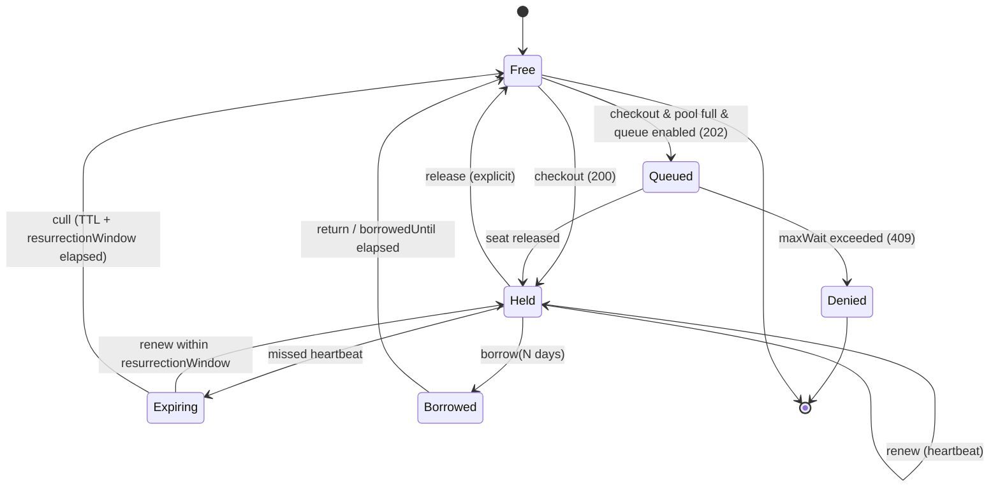

# 7. Floating licencie — protokol

> Časť zadania **Symbolon — licenčný server na .NET 10**. Späť na [obsah](README.md) · [prehľad projektu](../README.md).

## 7.1 Životný cyklus sedadla



## 7.2 Časovanie — a prečo je to najdôležitejšie číslo v projekte

Existuje generačná priepasť: FLEXlm-éra pracuje s timeoutmi 15 min – 2 h (FLEXlm `TIMEOUT` minimum 900 s, IBM Rational default 7 200 s, RLM `min_timeout` 3 600 s), cloud-éra s 60 s – 10 min (Keygen `heartbeatDuration` min. 60 s, keygen-relay default lease TTL 60 s).

Tento parameter určuje **ako dlho je mŕtve sedadlo nepoužiteľné po páde klienta**. To je jediná vec, na ktorú sa správca licencií u zákazníka sťažuje.

**Navrhované defaulty Symbolonu:**

| Parameter | Default | Rozsah | Zdôvodnenie |
|---|---|---|---|
| `lease.ttl` | **10 min** | 30 s – 24 h | Kompromis: pád klienta uvoľní sedadlo do 10 min bez toho, aby server dostával heartbeat každú minútu od 5 000 klientov |
| `lease.heartbeatInterval` | **2 min** | ttl/10 – ttl/2 | 5 zmeškaných heartbeatov pred expiráciou → odolné voči krátkym sieťovým výpadkom |
| `lease.resurrectionWindow` | **5 min** | 0 – 60 min | Klient, ktorý zmeškal heartbeat (spánok notebooku), dostane **späť svoje** sedadlo, nie cudzie |
| `lease.graceTtl` | **4 h** | 0 – 168 h | Bežiaca práca prežije výpadok relayu. Nad 168 h to prestáva byť grace a stáva sa to dierou |
| `queue.maxWait` | **2 min** | 0 – 30 min | Po tomto čase je lepšie povedať pravdu než držať používateľa v neistote |
| `borrow.maxDuration` | **7 dní** | 1 h – 30 dní | FlexNet default je 168 h; RLM cap 30 dní. Dlhšie = mŕtva kapacita |

**Dôležité:** `graceTtl` sa počíta od **posledného úspešného renew**, nie od pádu servera, a je **zapečený v lease tokene**, ktorý klient už má. Klient teda nepotrebuje server na to, aby vedel, dokedy smie pokračovať. Grace sedadlá sa **nezapočítavajú navyše** k limitu (na rozdiel od LM-X, kde grace licencie idú *nad* serverové sedadlá) — sedadlo zostáva alokované, kým grace nevyprší. Toto je striktnejšie a zmluvne čistejšie.

## 7.3 Checkout — presná sekvencia

```mermaid
sequenceDiagram
    participant A as Aplikácia + SDK
    participant R as Relay
    participant C as Control Plane
    A->>A: fingerprint() → components + hash
    A->>R: POST /v1/leases {licenseKey, fp, features[], qty=1}
    R->>R: overiť .symlic (ES256 + ML-DSA-65)
    R->>R: overiť .symgrant (seq, exp, seatRange)
    R->>R: BEGIN; UPDATE seats … FOR UPDATE SKIP LOCKED LIMIT 1
    alt sedadlo voľné
        R->>R: podpísať lease token (ES256, kľúč z grantu)
        R->>R: audit(checkout)
        R-->>A: 200 {leaseId, token, expiresAt, renewAfter}
    else pool vyčerpaný & queue on
        R-->>A: 202 {queueTicket, retryAfter}
    else pool vyčerpaný
        R->>R: audit(deny)
        R-->>A: 409 problem+json seat-pool-exhausted, Retry-After
    end
    loop každé 2 min
        A->>R: POST /v1/leases/{id}/renew {seq}
        R-->>A: 200 {token, expiresAt}
    end
    A->>R: DELETE /v1/leases/{id}
    R->>C: POST /relay/v1/usage (dávkovo, každých 5 min alebo pri sync okne)
```

**Idempotencia.** `POST /v1/leases` prijíma hlavičku `Idempotency-Key`. Opakovaný checkout s rovnakým kľúčom v okne 60 s vráti ten istý lease — inak by retry po timeoute klienta zožral dve sedadlá. Toto je najčastejšia chyba v domácich implementáciách.

**Antientropia.** Ak klient pošle `renew` na lease, ktorý relay nepozná (relay bol reštartovaný a stratil SQLite, alebo klient prišiel k inému relayu), relay odpovie `410 Gone` s `lease-unknown` a klient musí urobiť nový checkout. Klient pritom **nesmie** medzitým zahodiť grace — pokračuje v práci do konca grace, ale pokúša sa o nový checkout.

## 7.4 Borrow / roaming

1. Klient: `POST /v1/leases/{id}/borrow {days: 5}`.
2. Relay overí `policy.borrow.enabled`, `maxDuration`, `maxConcurrent`, potom nastaví `seats.borrowed_until` a vydá **`.symlease` súbor** — samostatne overiteľný artefakt s hybridným podpisom a `exp = borrowedUntil` (nie 10 min).
3. Sedadlo je po celý čas obsadené. Nezapočítava sa žiadny „návrat" — počíta sa len `borrowed_until`.
4. Predčasné vrátenie: `DELETE /v1/leases/{id}` s pripojeným `.symlease` a podpísaným potvrdením klienta (`proof-of-possession`: klient podpíše nonce kľúčom, ktorý dostal pri borrow). Bez toho by ktokoľvek vedel cudzie sedadlo predčasne vrátiť.

> **Poznámka z konkurenčného prieskumu:** Sentinel RMS **nedovoľuje** predčasné vrátenie vzdialene vypožičaného sedadla vôbec. My to riešime proof-of-possession — je to malá, ale reálna výhoda v UX, ktorú vieme komunikovať.

## 7.5 Rezervácie a zákazy (ekvivalent FlexNet options file)

Deklaratívny YAML, načítaný relayom, verzovaný, auditovaný:

```yaml
version: 1
license: lic_01JQ8ZK4N9V2X6M0
rules:
  - reserve: 5
    for: { group: "cad-power-users" }
    feature: "module.cad-export"
  - deny:
      hosts: ["build-agent-*"]
    reason: "CI nesmie brať interaktívne sedadlá"
  - max: 3
    for: { group: "contractors" }
  - priority: 10
    for: { group: "cad-power-users" }   # poradie vo fronte
```
Rezervované sedadlá sú jednoducho `seats` riadky s `reserved_for` — opäť invariant v schéme, nie v `if`-och.

## 7.6 Node-locking a fingerprint

**Komponenty** (každý voliteľný, zbierané SDK):

| Kód | Windows | Linux | macOS |
|---|---|---|---|
| `machineId` | `HKLM\SOFTWARE\Microsoft\Cryptography\MachineGuid` | `/etc/machine-id` | `IOPlatformUUID` |
| `board` | Win32_BaseBoard SerialNumber | DMI `board_serial` | — |
| `cpu` | CPUID vendor+model | `/proc/cpuinfo` | `sysctl machdep.cpu` |
| `disk` | serial systémového zväzku | `/dev/disk/by-id` | IOKit |
| `mac` | prvá non-virtuálna MAC | `/sys/class/net/*/address` | `ifconfig` |
| `host` | hostname (**pseudonymizovaný**, viď 9.8) | | |

**Matching stratégie** (prevzaté od Keygenu/Cryptlexu, lebo sú odladené praxou): `match-any`, `match-two`, `match-most` (default), `match-all`.

**Kontajnery, VM, autoscaling — dôležité pravidlo:** hardvérový fingerprint v kontajneri je **anti-pattern**. Golden image nesie identický `MachineGuid`/`machine-id` do všetkých inštancií; VM klon duplikuje všetko. SDK preto:

```
if (IsContainerized() || IsCloudInstance())
    → fingerprint = perzistovaný náhodný UUID vo volume
      (alebo cloud instance-id), NIE hardvér
    → a odporuč floating s krátkym TTL namiesto node-lock
```
Detekcia: `/.dockerenv`, `/proc/1/cgroup`, `KUBERNETES_SERVICE_HOST`, cloud metadata endpointy. Toto sa musí zdokumentovať výslovne, lebo je to najčastejší zdroj supportných tiketov u celej konkurencie.

## 7.7 Air-gapped tok

```
[air-gapped sieť]                        [online]
relay --(1) symbolon-relay grant:request --> .symreq  (JSON, podpísaný relay kľúčom)
                        ── USB ──>
                                     (2) symbolon grant:issue --in req.symreq
                                         alebo POST /v1/offline/requests
                        <── USB ──
relay <--(3) grant:import .symgrant
```
`.symreq` obsahuje: `relayId`, `licenseKey`, `requestedSeats`, `lastSeq`, `usageDigest` (hash-chain koreň auditu od posledného grantu), `nonce`, podpis. `usageDigest` je dôležitý: bez neho by air-gapped relay mohol donekonečna žiadať granty a nikdy nepriznať využitie. Control plane pri vydaní ďalšieho grantu **vyžaduje** digest nadväzujúci na predchádzajúci.

---

[← 6. Architektúra](06-architektura.md) · [Obsah](README.md) · [8. Referenčná implementácia (.NET 10) →](08-referencna-implementacia.md)
