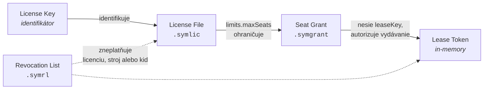

# 1. Artefakty

> [Obsah](README.md) · [License Key →](02-license-key.md)

Symbolon definuje **päť samostatných artefaktov**. Nie sú to varianty jedného formátu —
majú rôznu životnosť, rôzne požiadavky na podpis a rôzneho spotrebiteľa.

| Artefakt | Prípona | Nesie | Životnosť | Podpis |
|---|---|---|---|---|
| **License Key** | — | *nič* (je to len identifikátor) | trvalá | žiadny |
| **License File** | `.symlic` | entitlements, limity, viazanie | 30 d – 20 r | hybrid ES256 + ML-DSA-65 |
| **Lease Token** | — (in-memory) | sedadlo, exp, fingerprint hash | 30 s – 10 min | ES256 (voliteľne + ML-DSA-44) |
| **Seat Grant** | `.symgrant` | delegovaná kapacita relayu | hodiny – dni | hybrid |
| **Revocation List** | `.symrl` | zoznam revokovaných | krátke TTL | hybrid |

> **Zdôvodnenie (nenormatívne).** Bežná chyba je zlúčiť dve nezlučiteľné požiadavky do
> jedného reťazca: *„musí sa dať prepísať z papiera"* a *„musí niesť podpísané dáta"*.
> S post-kvantovými podpismi je to definitívne nemožné — podpis ML-DSA-65 má **3 309
> bajtov**, teda ~5 300 znakov v Base32. Oddelenie kľúča od dát je preto nutnosť, nie
> elegancia.

## 1.1 Vzťahy

## 1.2 Spoločné pravidlá

**ART-1.** Všetky podpísané artefakty MUSIA používať JWS podľa
[RFC 7515](https://www.rfc-editor.org/rfc/rfc7515). Artefakty s viacerými podpismi
(`.symlic`, `.symgrant`, `.symrl`) MUSIA používať **General JSON Serialization**
(RFC 7515 §7.2); Lease Token MUSÍ používať **Compact Serialization** (§7.1).

**ART-2.** Post-kvantové algoritmy sa v hlavičke `alg` MUSIA označovať podľa
[RFC 9964](https://datatracker.ietf.org/doc/draft-ietf-cose-dilithium/) — teda
`ML-DSA-44`, `ML-DSA-65`, `ML-DSA-87`, s typom kľúča `kty: AKP` v JWKS.

**ART-3.** Časové polia (`iat`, `nbf`, `exp`) MUSIA byť *NumericDate* podľa
[RFC 7519](https://www.rfc-editor.org/rfc/rfc7519) §2 — teda počet sekúnd od
epochy UTC. Trvania mimo časových polí (napr. `ttl`, `graceTtl`) MUSIA byť
ISO-8601 duration (`PT10M`, `P7D`).

**ART-4.** Identifikátory entít (`sub`, `jti`, `aud` pri relayoch) MUSIA byť
[ULID](https://github.com/ulid/spec) s doménovým prefixom: `lic_`, `lf_`, `lse_`,
`gnt_`, `rly_`, `mch_`.

**ART-5.** Všetky rozhodnutia o platnosti sa robia nad **serverovým časom**. Klient
NESMIE prijať artefakt, ktorého overenie závisí výlučne na jeho lokálnych hodinách.
Konkrétne pravidlá: [`LIC-29`, `LIC-30`](03-symlic-1.md#343-časová-a-stavová-validácia)
(tolerancia posunu a odmietnutie rollbacku hodín) a
[`FLT-5`, `FLT-6`](07-floating-protokol.md#72-časovanie) (grace sa počíta od posledného
úspešného `renew` a je zapečený v tokene).

**ART-6.** Neznáme polia v claims sa MUSIA ignorovať, pokiaľ nie sú uvedené v `crit`
hlavičky `protected`. Neznáme pole uvedené v `crit` MUSÍ viesť k odmietnutiu artefaktu
(RFC 7515 §4.1.11).

---

> [Obsah](README.md) · [License Key →](02-license-key.md)
