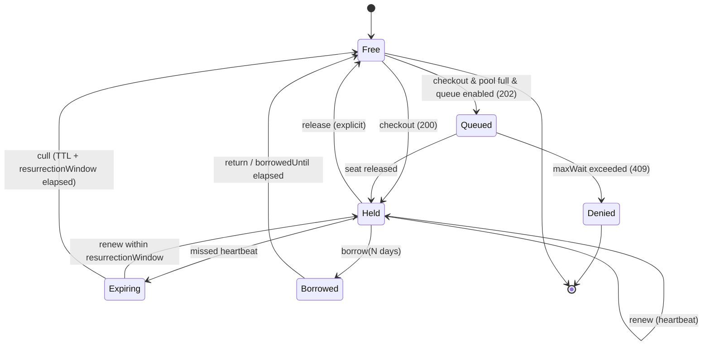

# 7. Floating protokol

> [← Revocation List](06-revocation-list.md) · [Obsah](README.md) · [Fingerprint →](08-fingerprint.md)

Protokol pre súbežné (concurrent) licencie: ako klient získa sedadlo, ako ho udržiava
a ako ho stratí.

---

## 7.1 Životný cyklus sedadla



**FLT-1.** Vydávajúci uzol MUSÍ implementovať presne tieto stavy a prechody. Prechod
neuvedený v diagrame NESMIE nastať.

**FLT-2.** Prechod `Expiring → Held` (*resurrection*) MUSÍ vrátiť klientovi
**to isté sedadlo**, ktoré držal predtým. Uzol NESMIE v tomto prechode prideliť cudzie
sedadlo.

> **Zdôvodnenie (nenormatívne).** Notebook, ktorý sa uspal na 6 minút, má dostať späť
> svoje miesto. Pridelenie iného sedadla by v `match-most` režime spôsobilo zbytočnú
> zmenu viazania.

---

## 7.2 Časovanie

Toto sú najdôležitejšie čísla v systéme: určujú, **ako dlho je mŕtve sedadlo
nepoužiteľné po páde klienta**.

| Parameter | Default | Povolený rozsah |
|---|---|---|
| `lease.ttl` | **10 min** | 30 s – 24 h |
| `lease.heartbeatInterval` | **2 min** | `ttl`/10 – `ttl`/2 |
| `lease.resurrectionWindow` | **5 min** | 0 – 60 min |
| `lease.graceTtl` | **4 h** | 0 – 168 h |
| `queue.maxWait` | **2 min** | 0 – 30 min |
| `borrow.maxDuration` | **7 dní** | 1 h – 30 dní |

**FLT-3.** Implementácia MUSÍ vynútiť uvedené rozsahy. Hodnota mimo rozsahu MUSÍ
viesť k odmietnutiu konfigurácie pri štarte, nie k tichému orezaniu.

**FLT-4.** `heartbeatInterval` MUSÍ byť najviac `ttl`/2, aby klient stihol aspoň dva
pokusy pred expiráciou.

**FLT-5.** `graceTtl` sa MUSÍ počítať od **posledného úspešného `renew`**, nie od
okamihu, keď server prestal odpovedať.

**FLT-6.** `graceTtl` MUSÍ byť zapečený v lease tokene, ktorý klient už má.
Klient NESMIE potrebovať server na to, aby zistil, dokedy smie pokračovať.

**FLT-7.** Sedadlo v grace režime MUSÍ zostať alokované a **NESMIE** sa započítať
navyše k limitu.

> **Zdôvodnenie (nenormatívne).** Niektoré systémy vydávajú grace licencie *nad*
> serverové sedadlá. To je zmluvne nečisté — zákazník krátkodobo beží nad zaplateným
> limitom. `FLT-7` je striktnejšie.

**FLT-8.** Hodnota `graceTtl` nad 168 hodín sa NESMIE povoliť.

---

## 7.3 Checkout

```mermaid
sequenceDiagram
    participant A as Aplikácia + SDK
    participant R as Relay
    participant C as Control Plane
    A->>A: fingerprint() → components + hash
    A->>R: POST /v1/leases {licenseKey, fp, features[], qty=1}
    R->>R: overiť .symlic (ES256 + ML-DSA-65)
    R->>R: overiť .symgrant (seq, exp, seatRange)
    R->>R: BEGIN; UPDATE seats … FOR UPDATE SKIP LOCKED LIMIT 1
    alt sedadlo voľné
        R->>R: podpísať lease token (ES256, kľúč z grantu)
        R->>R: audit(checkout)
        R-->>A: 200 {leaseId, token, expiresAt, renewAfter}
    else pool vyčerpaný & queue on
        R-->>A: 202 {queueTicket, retryAfter}
    else pool vyčerpaný
        R->>R: audit(deny)
        R-->>A: 409 problem+json seat-pool-exhausted, Retry-After
    end
    loop každé 2 min
        A->>R: POST /v1/leases/{id}/renew {seq}
        R-->>A: 200 {token, expiresAt}
    end
    A->>R: DELETE /v1/leases/{id}
    R->>C: POST /relay/v1/usage (dávkovo, každých 5 min alebo pri sync okne)
```

**FLT-9.** Uzol MUSÍ pred pridelením sedadla overiť licenčný súbor podľa
[`LIC-21`–`LIC-34`](03-symlic-1.md#34-validácia-normatívne) a — ak ide o relay —
grant podľa [`GNT-6`](05-seat-grant.md#53-disjunktnosť--hlavný-invariant).

**FLT-10.** Pridelenie sedadla MUSÍ byť atomické. Implementácia NESMIE prideľovať
sedadlo na základe počítania (`COUNT(*)`) aktívnych leases.

> **Zdôvodnenie (nenormatívne).** Referenčná implementácia materializuje `maxSeats`
> riadkov a vyberá jeden cez `SELECT … FOR UPDATE SKIP LOCKED LIMIT 1`. Limit sa potom
> nedá porušiť ani pri race condition, lebo neexistuje viac riadkov než limit —
> invariant je vynútený schémou, nie kódom. Špecifikácia nevyžaduje túto konkrétnu
> techniku, ale vyžaduje **rovnako silnú záruku**.

**FLT-11.** Súbežné checkouty na tú istú licenciu NESMÚ prekročiť `limits.maxSeats`
(plus sedadlá povolené `overageStrategy`) za žiadnych okolností — vrátane reštartu
uzla a posunu systémových hodín.

### 7.3.1 Idempotencia

**FLT-12.** `POST /v1/leases` MUSÍ akceptovať hlavičku `Idempotency-Key`.

**FLT-13.** Opakovaný checkout s rovnakým `Idempotency-Key` v okne **60 sekúnd**
MUSÍ vrátiť **ten istý lease**, nie nový.

> **Zdôvodnenie (nenormatívne).** Bez toho retry po klientskom timeoute spotrebuje dve
> sedadlá. Toto je najčastejšia chyba v domácich implementáciách.

### 7.3.2 Antientropia

**FLT-14.** Ak klient pošle `renew` na lease, ktorý uzol nepozná, uzol MUSÍ odpovedať
`410 Gone` s typom problému `lease-unknown`.

**FLT-15.** Klient po `410 Gone` MUSÍ vykonať nový checkout.

**FLT-16.** Klient po `410 Gone` **NESMIE** zahodiť grace. MUSÍ pokračovať v práci
do konca `graceTtl` a súbežne sa pokúšať o nový checkout.

> **Zdôvodnenie (nenormatívne).** `410 Gone` nastáva pri reštarte relayu so stratou
> SQLite alebo keď klient prišiel k inému relayu. Ani jedno nie je dôvod prerušiť
> zákazníkovi prebiehajúcu prácu.

---

## 7.4 Borrow / roaming

**FLT-17.** Klient žiada výpožičku cez `POST /v1/leases/{id}/borrow {days: N}`.

**FLT-18.** Uzol MUSÍ overiť `policy.borrow.enabled`, `maxDuration` a `maxConcurrent`
pred vydaním.

**FLT-19.** Uzol MUSÍ vydať artefakt **`.symlease`** — samostatne overiteľný súbor
s hybridným podpisom a `exp` rovným `borrowedUntil` (nie `lease.ttl`).

**FLT-20.** Vypožičané sedadlo MUSÍ zostať obsadené po celý čas do `borrowedUntil`.
Uzol NESMIE očakávať ani vyžadovať heartbeat.

**FLT-21.** Predčasné vrátenie sa vykoná cez `DELETE /v1/leases/{id}` s pripojeným
`.symlease` a **proof-of-possession**: klient MUSÍ podpísať serverom vydaný nonce
kľúčom, ktorý dostal pri borrow.

**FLT-22.** Uzol NESMIE prijať predčasné vrátenie bez platného proof-of-possession.

> **Zdôvodnenie (nenormatívne).** Bez `FLT-22` by ktokoľvek vedel predčasne vrátiť
> cudzie sedadlo a odobrať kolegovi rozpracovanú prácu.

> ⚠️ **Nedokončené.** Štruktúra claimov artefaktu `.symlease` a formát nonce nie sú
> v tomto drafte špecifikované. Viď [známe medzery](README.md#známe-medzery).

---

## 7.5 Rezervácie a zákazy

Deklaratívny YAML, načítaný uzlom, verzovaný a auditovaný:

```yaml
version: 1
license: lic_01JQ8ZK4N9V2X6M0
rules:
  - reserve: 5
    for: { group: "cad-power-users" }
    feature: "module.cad-export"
  - deny:
      hosts: ["build-agent-*"]
    reason: "CI nesmie brať interaktívne sedadlá"
  - max: 3
    for: { group: "contractors" }
  - priority: 10
    for: { group: "cad-power-users" }
```

**FLT-23.** Rezervované sedadlá MUSIA byť materializované ako sedadlá s atribútom
`reserved_for`, nie vyhodnocované podmienkou pri každom checkoute.

**FLT-24.** Pravidlá sa MUSIA vyhodnocovať v poradí `deny` → `max` → `reserve` →
`priority`. Prvé `deny`, ktoré vyhovie, MUSÍ ukončiť vyhodnocovanie.

**FLT-25.** Zmena súboru pravidiel MUSÍ byť auditovaná a NESMIE odobrať už pridelené
sedadlo pred koncom jeho `ttl`.

---

## 7.6 Endpointy

**FLT-26.** Vydávajúci uzol MUSÍ implementovať:

| Metóda | Cesta | Účel |
|---|---|---|
| `POST` | `/v1/leases` | Checkout sedadla → lease token |
| `POST` | `/v1/leases/{id}/renew` | Heartbeat + predĺženie |
| `DELETE` | `/v1/leases/{id}` | Uvoľnenie |
| `POST` | `/v1/leases/{id}/borrow` | Roaming na N dní |
| `POST` | `/v1/activations` | Node-lock aktivácia stroja |
| `DELETE` | `/v1/activations/{id}` | Deaktivácia |
| `GET` | `/v1/licenses/{key}/file?ttl=P30D` | Vydanie `.symlic` |
| `GET` | `/v1/revocations/latest?since={seq}` | Delta revokačný zoznam |
| `GET` | `/v1/.well-known/symbolon-keys` | JWKS (EC + `kty: AKP`) |
| `POST` | `/v1/offline/requests` | Air-gapped: `.symreq` → `.symgrant` / `.symlic` |

**FLT-27.** Rozhranie relay ↔ control plane (`/relay/v1`) MUSÍ byť chránené **mTLS**:
`POST /register`, `POST /grants:request`, `POST /usage`, `GET /policy`,
`POST /grants/{id}:extend`.

### 7.6.1 Chyby

**FLT-28.** Všetky chybové odpovede MUSIA byť `application/problem+json` podľa
[RFC 9457](https://www.rfc-editor.org/rfc/rfc9457) s doménovým `type` URI.

**FLT-29.** Uzol MUSÍ používať minimálne tieto typy problémov:

| HTTP | `type` (relatívne k `https://symbolon.dev/problems/`) | Kedy |
|---|---|---|
| `409` | `seat-pool-exhausted` | pool vyčerpaný, queue vypnutá |
| `410` | `lease-unknown` | `renew` na neznámy lease |
| `403` | `license-revoked` | licencia alebo `kid` v revokačnom zozname |
| `403` | `fingerprint-mismatch` | viazanie nesedí podľa `matching` |
| `400` | `license-file-invalid` | zlyhala validácia `LIC-*` |
| `503` | `grant-expired` | relay nemá platný grant |

**FLT-30.** Pri `409 seat-pool-exhausted` MUSÍ odpoveď obsahovať hlavičku `Retry-After`.

**FLT-31.** Odpoveď `202` pri zaradení do fronty MUSÍ obsahovať `queueTicket`
a `retryAfter`.

> ⚠️ **Nedokončené.** Formát `queueTicket` nie je špecifikovaný. Viď
> [známe medzery](README.md#známe-medzery).

---

## 7.7 Air-gapped tok

```
[air-gapped sieť]                        [online]
relay --(1) symbolon-relay grant:request --> .symreq  (JSON, podpísaný relay kľúčom)
                        ── USB ──>
                                     (2) symbolon grant:issue --in req.symreq
                                         alebo POST /v1/offline/requests
                        <── USB ──
relay <--(3) grant:import .symgrant
```

**FLT-32.** `.symreq` MUSÍ byť podpísaný identitným kľúčom relayu a MUSÍ obsahovať:

| Pole | Význam |
|---|---|
| `relayId` | ID relayu |
| `licenseKey` | licencia, pre ktorú sa žiada kapacita |
| `requestedSeats` | požadovaný počet sedadiel |
| `lastSeq` | posledná `seq` grantu, ktorú relay pozná |
| `usageDigest` | koreň hash-reťazca auditu od posledného grantu |
| `nonce` | ochrana proti replay |

**FLT-33.** Vydavateľ MUSÍ pri vydaní ďalšieho grantu **vyžadovať** `usageDigest`
nadväzujúci na predchádzajúci. Grant so `seq > lastSeq + 1` sa NESMIE vydať bez
priznaného využitia.

> **Zdôvodnenie (nenormatívne).** Bez `FLT-33` by air-gapped relay mohol donekonečna
> žiadať granty a nikdy nepriznať využitie — teda obísť celé účtovanie.

**FLT-34.** Vydavateľ MUSÍ odmietnuť `.symreq` s už videným `nonce`.

**FLT-35.** Odpoveď MÔŽE obsahovať aj obnovený `.symlic` a aktuálny `.symrl`, aby
jedna výmena cez USB pokryla všetky tri artefakty.

---

## 7.8 Hlásenie využitia

**FLT-36.** Relay MUSÍ hlásiť využitie cez `POST /relay/v1/usage` dávkovo. ODPORÚČA
sa interval 5 minút alebo pri najbližšom sync okne.

**FLT-37.** Audit záznamy MUSIA tvoriť **append-only** reťaz so serverovými časovými
pečiatkami a hash-reťazením (`prev_hash`, `hash`).

**FLT-38.** Peak concurrency sa MUSÍ počítať z auditného reťazca, nie vzorkovaním.

**FLT-39.** Uzol MUSÍ auditovať aj **zamietnutia** (`deny`), nielen úspešné checkouty.

> **Zdôvodnenie (nenormatívne).** Zamietnutia sú to, čo zákazníkovi dokazuje, že
> potrebuje viac sedadiel. Bez nich nemá true-up žiadny podklad.

---

> [← Revocation List](06-revocation-list.md) · [Obsah](README.md) · [Fingerprint →](08-fingerprint.md)
