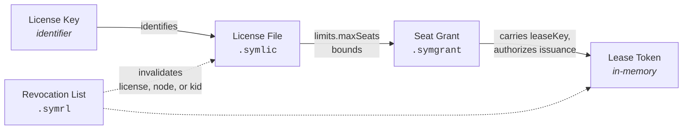

# 1. Artifacts

> [Table of Contents](README.md) · [License Key →](02-license-key.md)

Symbolon defines **five distinct artifacts**. They are not stylistic variants of a single format — each has a different lifetime, signature requirement, and consumer.

| Artifact | Extension | Payload | Lifetime | Signature Scheme |
|---|---|---|---|---|
| **License Key** | — | *none* (identifier only) | Permanent | None |
| **License File** | `.symlic` | Entitlements, limits, hardware binding | 30 days – 20 years | Hybrid ES256 + ML-DSA-65 |
| **Lease Token** | — (in-memory) | Seat number, exp, fingerprint hash | 30 s – 10 min | ES256 (optional + ML-DSA-44) |
| **Seat Grant** | `.symgrant` | Delegated seat capacity for relay | Hours – days | Hybrid |
| **Revocation List** | `.symrl` | List of revoked entities | Short TTL | Hybrid |

> **Non-Normative Rationale.** A frequent architectural mistake is attempting to merge two mutually incompatible requirements into a single token: *"must be human-typable from paper"* and *"must carry cryptographically signed data"*. With post-quantum cryptography, this is mathematically impossible — an ML-DSA-65 signature alone is **3,309 bytes** (~5,300 characters in Base32). Separating the identifier from the payload is therefore an engineering necessity.

---

## 1.1 Relationships

---

## 1.2 Common Rules

**ART-1.** All signed artifacts MUST use JSON Web Signature (JWS) conforming to [RFC 7515](https://www.rfc-editor.org/rfc/rfc7515). Multi-signature artifacts (`.symlic`, `.symgrant`, `.symrl`) MUST use **General JSON Serialization** (RFC 7515 §7.2); Lease Tokens MUST use **Compact Serialization** (§7.1).

**ART-2.** Post-quantum algorithms in the `alg` header MUST follow [RFC 9964](https://datatracker.ietf.org/doc/draft-ietf-cose-dilithium/) naming: `ML-DSA-44`, `ML-DSA-65`, `ML-DSA-87`, with key type `kty: AKP` in JWKS.

**ART-3.** Time fields (`iat`, `nbf`, `exp`) MUST be *NumericDate* according to [RFC 7519](https://www.rfc-editor.org/rfc/rfc7519) §2 (seconds since UTC epoch). Duration fields (e.g. `ttl`, `graceTtl`) MUST follow ISO-8601 duration format (`PT10M`, `P7D`).

**ART-4.** Entity identifiers (`sub`, `jti`, `aud` for relays) MUST be [ULID](https://github.com/ulid/spec) prefixed with domain tags: `lic_`, `lf_`, `lse_`, `gnt_`, `rly_`, `mch_`.

**ART-5.** All validity decisions are made based on **server time**. A client MUST NOT accept an artifact whose verification relies solely on unsynchronized local clocks.
