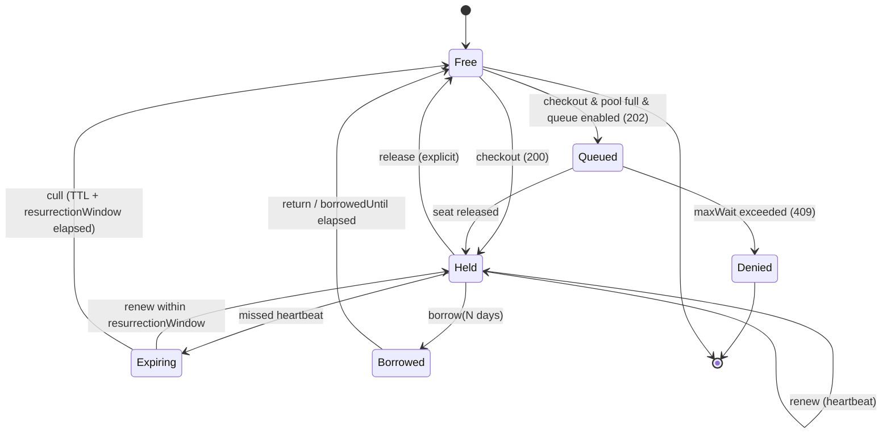

# 7. Floating Protocol

> [← Revocation List](06-revocation-list.md) · [Table of Contents](README.md) · [Fingerprint & Node-Locking →](08-fingerprint.md)

The protocol for concurrent floating licenses: how a client acquires a seat, maintains it via heartbeats, and releases it upon completion.

---

## 7.1 Seat Lifecycle



**FLT-1.** An issuing node MUST implement exactly these states and transitions. Transitions not defined in the state diagram MUST NOT occur.

**FLT-2.** The transition `Expiring → Held` (*resurrection*) MUST return to the client **the exact same seat** it held previously. The node MUST NOT reassign another seat during this transition.

> **Non-Normative Rationale.** A laptop put to sleep for 6 minutes should reclaim its exact seat upon waking. Allocating a different seat would trigger unnecessary hardware binding renegotiation under `match-most` mode.

---

## 7.2 Timing Parameters

These timing parameters govern system responsiveness and define **how long a dead seat remains unusable after a client crash**.

| Parameter | Default | Allowed Range |
|---|---|---|
| `lease.ttl` | **10 min** | 30 s – 24 h |
| `lease.heartbeatInterval` | **2 min** | `ttl`/10 – `ttl`/2 |
| `lease.resurrectionWindow` | **5 min** | 0 – 60 min |
| `lease.graceTtl` | **4 h** | 0 – 168 h |
| `queue.maxWait` | **2 min** | 0 – 30 min |
| `borrow.maxDuration` | **7 days** | 1 h – 30 days |

**FLT-3.** Implementations MUST enforce these ranges. Any value outside the allowed range MUST lead to rejection of configuration at startup, rather than silent clamping.

**FLT-4.** `heartbeatInterval` MUST NOT exceed `ttl`/2, ensuring the client has at least two renewal opportunities before expiration.

**FLT-5.** `graceTtl` MUST be computed from the **timestamp of the last successful `renew`**, not from the moment the server became unreachable.

**FLT-6.** `graceTtl` MUST be embedded within the lease token already held by the client. The client MUST NOT depend on server connectivity to know how long it may continue operating in grace mode.

**FLT-7.** A seat operating in grace mode MUST remain allocated and **MUST NOT** be counted as excess oversubscription.

> **Non-Normative Rationale.** Some legacy systems grant grace licenses *on top of* active server seats. This is contractually problematic, as customers temporarily run beyond their paid capacity. `FLT-7` enforces strict capacity integrity.

**FLT-8.** A `graceTtl` value exceeding 168 hours (7 days) MUST NOT be permitted.

---

## 7.3 Checkout

```mermaid
sequenceDiagram
    participant A as Application + SDK
    participant R as Relay
    participant C as Control Plane
    A->>A: fingerprint() → components + hash
    A->>R: POST /v1/leases {licenseKey, fp, features[], qty=1}
    R->>R: verify .symlic (ES256 + ML-DSA-65)
    R->>R: verify .symgrant (seq, exp, seatRange)
    R->>R: BEGIN; UPDATE seats … FOR UPDATE SKIP LOCKED LIMIT 1
    alt seat available
        R->>R: sign lease token (ES256, key from grant)
        R->>R: audit(checkout)
        R-->>A: 200 {leaseId, token, expiresAt, renewAfter}
    else pool exhausted & queue enabled
        R-->>A: 202 {queueTicket, retryAfter}
    else pool exhausted
        R->>R: audit(deny)
        R-->>A: 409 problem+json seat-pool-exhausted, Retry-After
    end
    loop every 2 min
        A->>R: POST /v1/leases/{id}/renew {seq}
        R-->>A: 200 {token, expiresAt}
    end
    A->>R: DELETE /v1/leases/{id}
    R->>C: POST /relay/v1/usage (batched, every 5 min or at sync window)
```

**FLT-9.** Prior to allocating a seat, the node MUST verify the license file according to [`LIC-21`–`LIC-34`](03-symlic-1.md#34-normative-validation-pipeline) and — for relays — the seat grant according to [`GNT-6`](05-seat-grant.md#53-disjointness--the-main-invariant).

**FLT-10.** Seat allocation MUST be atomic. An implementation MUST NOT allocate seats by executing counting queries (`COUNT(*)`) against active leases.

> **Non-Normative Rationale.** The reference implementation materializes `maxSeats` database rows and acquires one via `SELECT … FOR UPDATE SKIP LOCKED LIMIT 1`. Concurrency limits cannot be breached even under extreme race conditions because there physically exist no more rows than the limit — the invariant is guaranteed by database schema constraints rather than application code. The specification mandates **an equally strong atomicity guarantee**.

**FLT-11.** Concurrently active checkouts against the same license MUST NOT exceed `limits.maxSeats` (plus any overage allowance permitted by `overageStrategy`) under any circumstances — including server restarts and system clock skew.

### 7.3.1 Idempotency

**FLT-12.** `POST /v1/leases` MUST support the `Idempotency-Key` header.

**FLT-13.** Repeated checkout requests carrying the same `Idempotency-Key` within a **60-second window** MUST return **the identical lease**, not allocate a new seat.

> **Non-Normative Rationale.** Without idempotency, a client network timeout and retry would consume two distinct seats. This is the single most common defect in proprietary licensing implementations.

### 7.3.2 Anti-Entropy

**FLT-14.** If a client submits a `renew` request for a lease unknown to the node, the node MUST respond with `410 Gone` and problem type `lease-unknown`.

**FLT-15.** Upon receiving `410 Gone`, the client MUST initiate a new checkout.

**FLT-16.** Upon receiving `410 Gone`, the client **MUST NOT** discard its active grace period. It MUST continue execution until `graceTtl` expires while concurrently attempting to acquire a new lease.

> **Non-Normative Rationale.** `410 Gone` occurs when a relay restarts with an ephemeral or restored database, or when a roaming client connects to an alternate relay. Neither scenario justifies aborting active customer work.

---

## 7.4 Borrow / Roaming

**FLT-17.** A client requests an offline borrow via `POST /v1/leases/{id}/borrow {days: N}`.

**FLT-18.** The node MUST verify `policy.borrow.enabled`, `maxDuration`, and `maxConcurrent` before granting a borrow.

**FLT-19.** The node MUST issue a **`.symlease`** artifact — a standalone verifiable file with hybrid signature and `exp` set to `borrowedUntil` (rather than short `lease.ttl`).

**FLT-20.** A borrowed seat MUST remain marked as occupied for the entire duration until `borrowedUntil`. The issuing node MUST NOT expect or require heartbeats for borrowed seats.

**FLT-21.** Early return is initiated via `DELETE /v1/leases/{id}` supplying the `.symlease` artifact and **proof-of-possession**: the client MUST sign a server-issued challenge nonce using the private key generated during borrow initialization.

**FLT-22.** An issuing node MUST NOT accept an early return without valid cryptographic proof-of-possession.

> **Non-Normative Rationale.** Without `FLT-22`, an unauthorized actor could prematurely release a colleague's borrowed license, terminating their field work.

### 7.4.1 `.symlease` Artifact Schema

The `.symlease` artifact is a standalone verifiable PEM document with the label `SYMBOLON LEASE`, wrapping a JWS General JSON with protected header `typ: symlease+jws`.

```jsonc
{
  "iss": "https://licenses.acme.example",
  "sub": "lic_01JQ8ZK4N9V2X6M0",
  "jti": "lse_01JQ8ZK5T3P7Q1R4",
  "iat": 1788480000,
  "nbf": 1788480000,
  "exp": 1789084800,
  "seat": 7,
  "fp": "sha256:9f2c5d…",
  "ent": ["core", "module.cad-export"],
  "borrow": {
    "days": 7,
    "borrowedAt": 1788480000,
    "borrowedUntil": 1789084800,
    "possessionKeyJwk": "{\"kty\":\"EC\",\"crv\":\"P-256\",\"x\":\"…\",\"y\":\"…\"}"
  }
}
```

| Field | Type | Semantic Meaning |
|---|---|---|
| `sub` | string | Target license identifier (`lic_...`) |
| `jti` | string | Unique lease ULID matching `leaseId` |
| `exp` | NumericDate | Borrow expiration timestamp matching `borrowedUntil` |
| `seat` | integer | Allocated seat index |
| `fp` | string | Hardware fingerprint hash of the target machine |
| `ent` | array | Granted feature and entitlement codes |
| `borrow.days` | integer | Requested borrow duration in days |
| `borrow.borrowedUntil` | NumericDate | Timestamp marking the end of the roaming window |
| `borrow.possessionKeyJwk` | string | Public key (JWK) certifying return authorization |

**FLT-22a.** For early return via `DELETE /v1/leases/{id}`, the client transmits
`{ "symlease": "<pem>", "signature": "<sig>" }`. The node verifies that `<sig>` was generated
by the private key corresponding to `possessionKeyJwk` over a challenge nonce (composed of
`leaseId` and server timestamp).

---

## 7.5 Reservations and Denials

Access control is governed by declarative YAML loaded by the node, version-controlled and audited:

```yaml
version: 1
license: lic_01JQ8ZK4N9V2X6M0
rules:
  - reserve: 5
    for: { group: "cad-power-users" }
    feature: "module.cad-export"
  - deny:
      hosts: ["build-agent-*"]
    reason: "CI runners must not consume interactive engineering seats"
  - max: 3
    for: { group: "contractors" }
  - priority: 10
    for: { group: "cad-power-users" }
```

**FLT-23.** Reserved seats MUST be materialized as seats carrying a `reserved_for` attribute, rather than dynamically evaluated upon each checkout.

**FLT-24.** Rules MUST be evaluated strictly in order: `deny` → `max` → `reserve` → `priority`. The first matching `deny` rule MUST immediately terminate evaluation and reject the checkout.

**FLT-25.** Modifications to rule definitions MUST be recorded in the audit log and MUST NOT terminate an already allocated seat before its `ttl` expires.

---

## 7.6 Endpoints

**FLT-26.** The issuing node MUST implement the following REST endpoints:

| Method | Path | Purpose |
|---|---|---|
| `POST` | `/v1/leases` | Seat checkout → Lease Token |
| `POST` | `/v1/leases/{id}/renew` | Heartbeat keep-alive + renewal |
| `DELETE` | `/v1/leases/{id}` | Seat release |
| `POST` | `/v1/leases/{id}/borrow` | Offline roaming allocation for N days |
| `POST` | `/v1/activations` | Node-lock machine activation |
| `DELETE` | `/v1/activations/{id}` | Machine deactivation |
| `GET` | `/v1/licenses/{key}/file?ttl=P30D` | Issue signed `.symlic` snapshot |
| `GET` | `/v1/revocations/latest?since={seq}` | Delta Revocation List |
| `GET` | `/v1/.well-known/symbolon-keys` | JWKS endpoint (classical EC + `kty: AKP` PQC) |
| `POST` | `/v1/offline/requests` | Air-gapped processing: `.symreq` → `.symgrant` / `.symlic` |
| `GET` | `/v1/queue/{ticket}` | Poll queued seat status and position |
| `DELETE` | `/v1/queue/{ticket}` | Cancel queued wait request |
| `POST` | `/relay/v1/register` | Relay registration and identity provisioning |

**FLT-27.** The relay ↔ control plane interface (`/relay/v1`) MUST be protected with **mutual TLS (mTLS)**: `POST /register`, `POST /grants:request`, `POST /usage`, `GET /policy`, `POST /grants/{id}:extend`.

**FLT-27a.** Relay registration is performed via `POST /relay/v1/register` with request payload
`{ "name": "...", "mtlsThumbprint": "..." }` and optional `X-Tenant-Id` header.
The server responds with `201 Created` containing assigned identity `{ "relayId": "rly_...", "apiKey": "rlykey_..." }`.

**FLT-27b.** Protected endpoints under `/relay/v1/*` MUST verify relay identity
either by matching client certificate SHA-256 thumbprints against registered `mtlsThumbprint`,
or by verifying the `X-Relay-Key` header against stored `apiKey`.

### 7.6.1 Error Handling

**FLT-28.** All error responses MUST return `application/problem+json` conforming to [RFC 9457](https://www.rfc-editor.org/rfc/rfc9457) with domain-specific `type` URIs.

**FLT-29.** An issuing node MUST support at minimum these standard problem types:

| HTTP Status | `type` (relative to `https://symbolon.dev/problems/`) | Condition |
|---|---|---|
| `409` | `seat-pool-exhausted` | Pool exhausted, queuing disabled |
| `410` | `lease-unknown` | Renewal attempted on nonexistent or culled lease |
| `403` | `license-revoked` | License or signing `kid` found on revocation list |
| `403` | `fingerprint-mismatch` | Hardware binding check failed under active `matching` mode |
| `400` | `license-file-invalid` | Verification of `LIC-*` pipeline failed |
| `503` | `grant-expired` | Relay possesses no valid unexpired seat grant |

**FLT-30.** On `409 seat-pool-exhausted`, the response MUST include a standard `Retry-After` header.

### 7.6.2 Queue Ticket Format

**FLT-31.** An HTTP `202 Accepted` response when queuing a checkout request MUST return
a structured JSON payload:

```jsonc
{
  "status": "queued",
  "ticket": "tkt_01JQ8ZK4N9V2X6M0",
  "position": 3,
  "estimatedWait": "PT6M",
  "retryAfterSeconds": 30,
  "priority": 10
}
```

**FLT-31a.** The `ticket` field MUST be a unique ULID identifier prefixed with `tkt_`.
The `position` field indicates the 1-based order index in the waiting line.

**FLT-31b.** The client polls queue status via `GET /v1/queue/{ticket}`. When `status` transitions
to `"ready"`, the client MUST execute `POST /v1/leases` supplying `queueTicket` before
`resurrectionWindow` expires in order to claim the reserved seat. The client MAY cancel its queue position via `DELETE /v1/queue/{ticket}`.

---

## 7.7 Air-Gapped Flow

```
[Air-Gapped Network]                       [Online Network]
Relay --(1) symbolon-relay grant:request --> .symreq  (JSON, signed by relay key)
                        ── USB ──>
                                     (2) symbolon grant:issue --in req.symreq
                                         or POST /v1/offline/requests
                        <── USB ──
Relay <--(3) grant:import .symgrant
```

**FLT-32.** The `.symreq` file MUST be signed with the relay's private identity key and MUST contain:

| Field | Semantic Meaning |
|---|---|
| `relayId` | Unique ID of the requesting relay |
| `licenseKey` | Target license identifier |
| `requestedSeats` | Requested seat allocation capacity |
| `lastSeq` | Most recent grant `seq` known to the relay |
| `usageDigest` | Root of the tamper-evident audit hash chain accumulated since the last grant |
| `nonce` | Unique entropy protecting against replay attacks |

**FLT-33.** When issuing a subsequent grant, the issuer MUST **require** a valid `usageDigest` properly chained to previous activity. A grant with `seq > lastSeq + 1` MUST NOT be issued without verified usage telemetry.

> **Non-Normative Rationale.** Without `FLT-33`, an air-gapped relay could request renewal grants indefinitely without ever reporting consumption — completely evading contract billing.

**FLT-34.** The issuer MUST reject any `.symreq` containing a previously processed `nonce`.

**FLT-35.** The issuer response MAY package a renewed `.symlic` and current `.symrl` alongside the `.symgrant`, so a single physical USB transfer refreshes all three critical artifacts.

---

## 7.8 Usage Telemetry Reporting

**FLT-36.** A relay MUST report usage via `POST /relay/v1/usage` in batched intervals. An interval of 5 minutes or at the next synchronization opportunity is RECOMMENDED.

**FLT-37.** Audit log entries MUST form an **append-only** hash chain with server timestamps and cryptographic linking (`prev_hash`, `hash`).

**FLT-38.** Peak concurrency MUST be calculated directly from the immutable audit hash chain, never estimated via periodic sampling.

**FLT-39.** The issuing node MUST audit **denials** (`deny`) in addition to successful checkout operations.

> **Non-Normative Rationale.** Denials demonstrate to enterprise customers that their teams are experiencing contention, providing empirical evidence required for contractual true-ups.

---

> [← Revocation List](06-revocation-list.md) · [Table of Contents](README.md) · [Fingerprint & Node-Locking →](08-fingerprint.md)
